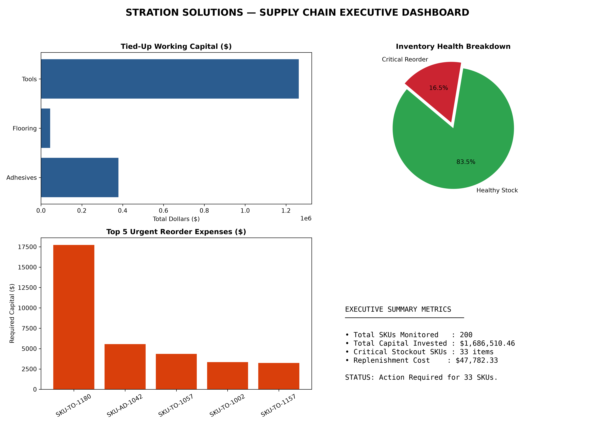

# Enterprise Supply Chain Analytics & Exception Engine (MVP)

An end-to-end Python and SQL data pipeline designed to ingest raw ERP inventory exports, normalize relational data, execute vectorized financial calculations, and generate executive-level operational exception reports.



---

Business Context & Problem Statement:
Mid-sized distribution and manufacturing firms often suffer from data opacity. Operational data remains trapped inside legacy ERP exports (e.g., Epicor, SAP, NetSuite) or unorganized spreadsheets. This leads to two critical operational friction points:
1. Unintentional Capital Lockup: Over-purchasing slow-moving inventory ties up vital working capital.
2. Reactive Stockouts: Supervisors only notice missing critical SKUs when customer orders fail on the warehouse floor.

This system bridges the gap by converting raw, tabular ERP exports into predictive operational visibility, instantly highlighting inventory health risks and identifying high-dollar reorder requirements before operations stall.

---

# System Architecture

### Core Architecture Highlights:
* **Ingestion Engine (`ingest_data.py`):** Ingests raw tabular data, converts type casting safely, handles tab/comma delimiter variations, and populates isolated database tables using parameterized SQL inserts.
* **Relational Storage (`supply_chain.db`):** Normalizes static product data (`products`) and volatile stock metrics (`inventory_status`) bound by strict primary key constraints.
* **Analytics Core (`analyze_inventory.py`):** Utilizes Pandas vectorized math to compute real-time capital allocation, stock deficit clamping, and reorder liabilities across hundreds of SKUs simultaneously.
* **Visual Reporting (`generate_dashboard.py`):** Uses Matplotlib to render a high-impact $2\times2$ executive dashboard displaying inventory breakdown, working capital distribution, and top dollar-value stockout risks.

---

## 📊 Key Performance Metrics Calculated

| Metric | Operational Purpose |
| :--- | :--- |
| **Total Tied-Up Capital** | Quantifies the total dollar value currently bound in warehouse racks by category. |
| **Critical Stockout Alerts** | Identifies items where Current Quantity On Hand $\le$ Reorder Threshold. |
| **Replenishment Liability** | Calculates the exact capital required today to bring critical stock back up to safe baseline levels. |

---

## 🚀 Quickstart & Execution

### Prerequisites
* Python 3.9+
* `pandas`, `matplotlib`, `sqlite3`

### Run the Pipeline
1. Clone the repository:
   ```bash
   git clone [https://github.com/YOUR_USERNAME/supply_chain_dashboard.git](https://github.com/YOUR_USERNAME/supply_chain_dashboard.git)
   cd supply_chain_dashboard


1.  Run data ingestion to populate SQLITE database:
python ingest_data.py

2.  Run analysis engine to generate dashboard:
python generate_dashboard.py

3.  View the generated report: supply_chain_dashboard.png

Tech Stack
Language:  Python
Database:  SQLite/SQL
Data Manipulation: Pandas
Visualization: Matplotlib
